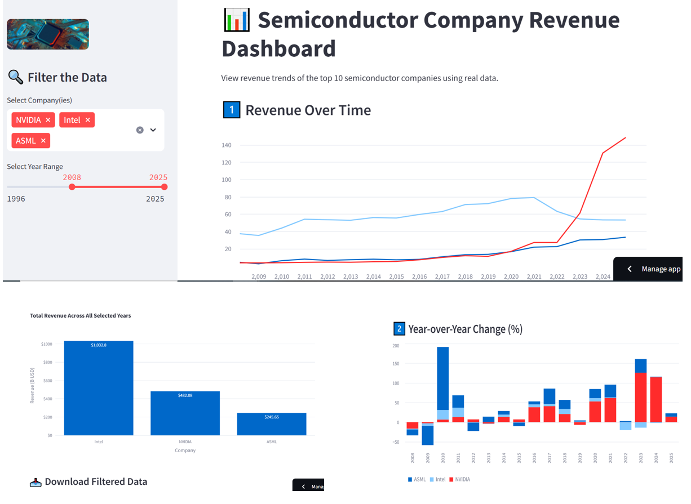

# 📊 Top 10 Semiconductor Companies – Revenue Dashboard

[](https://dashboard-semiconductor-revenue.streamlit.app/)

This project is a simple, interactive dashboard built with **Streamlit** to explore annual revenue data for the top 10 semiconductor companies in the world.  
Revenue data is extracted from [companiesmarketcap.com](https://companiesmarketcap.com/) using Python and web scraping tools.

---

## 🚀 Features

- 📈 View yearly revenue trends per company
- 🔍 Filter by year range and selected companies
- 📊 Compare annual growth rates visually
- 💾 Download filtered data as CSV
- 🧼 Clean, user-friendly Streamlit UI with Plotly charts

---

## 🖼️ Screenshot

  
> Add your app screenshot here and save it as `screenshot.png` in the root folder.

---

## 📁 Project Structure

```text
semiconductor-equipment-dashboard/
├── dashboard.py               # Streamlit app
├── top_10_revenues.csv        # Cleaned revenue dataset
├── requirements.txt           # Python dependencies
├── .gitignore
├── README.md
├── screenshot.png             # App screenshot
└── data/
    └── logo.png               # Logo for sidebar
```
## 👨‍💻 Author

**Zanyar Salami**  
Experimental physicist with a passion for data science and visualization.

- 🔗 [LinkedIn](https://www.linkedin.com/in/zanyar-salami-5707b581/)
- 💻 [GitHub](https://github.com/Zanyarsalami)
